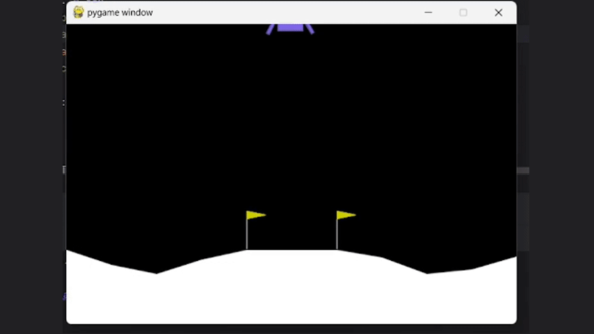
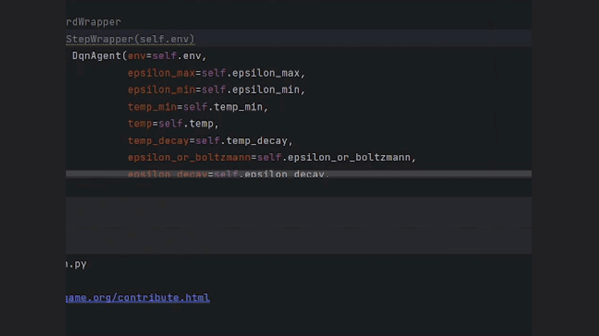
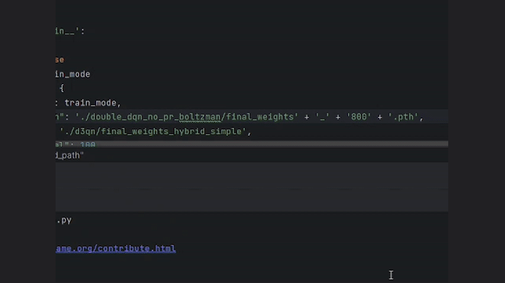
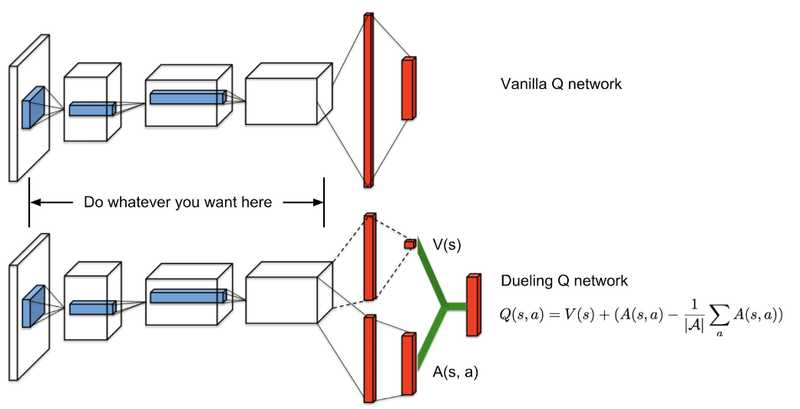
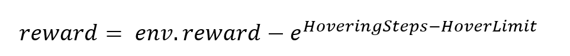
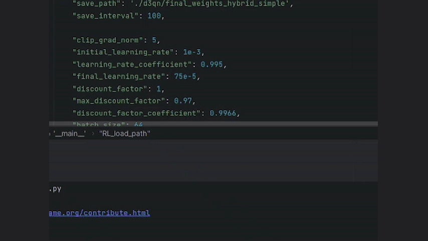
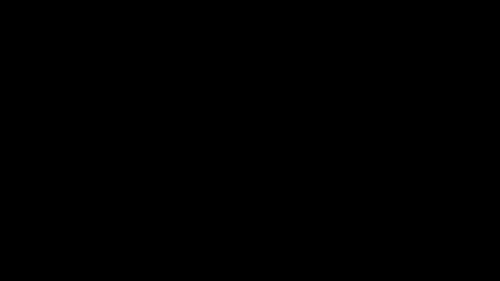
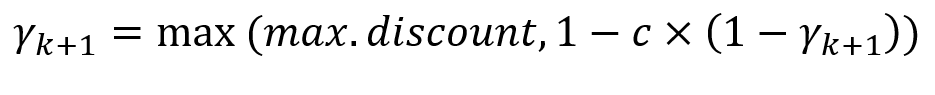

# Lunar-Lander
This project demonstrates several soloutions for the LunarLander [environment gymnasium](https://gymnasium.farama.org/environments/box2d/lunar_lander/). The environment is sloved mainly using double dqn and dueling double dqn (d3qn). But, for solving the challenges I faced during the training process, other methods combined with these two methods are tested in order to get the proper result which are fully described in this document. The two main methods are combined with different techniques like Boltzman policy, reward wrapping and even an imitation method of learning. The best solution (the one with the highest gained reward) was found using the last method. So bear with me.
## Table of Contents
- [Double DQN](#double-dqn)
  - [Double DQN Simple](#double-dqn-simple)
  - [Double DQN Simple With More Exploration](#double-dqn-simple-with-more-exploration)
  - [Double DQN Boltzman](#double-dqn-boltzman)
- [Dueling Double DQN](#dueling-double-dqn)
  - [Dueling Double DQN With Reward Wrapper](#dueling-double-dqn-with-reward-wrapper)
  - [Hybrid Dueling Double DQN With Reward Wrapper](#hybrid-dueling-double-dqn-with-reward-wrapper)
  - [Simple Hybrid Dueling Double DQN](#simple-hybrid-dueling-double-dqn)
  - [Imitation After D3QN](#imitation-after-d3qn)

## Double DQN
Double DQN is a way of improving the DQN method which seeks to solve the over estimation problem occured in the classical DQN. It also introduces a target network which is updated periodically and helps the main network to reduce its loss easier. In Double DQN, the target value for the main network is computed as displayed in the image below.

<p align="center">
  
</p>

### Double DQN Simple
In this section the model is just trained with plain states and rewards of the environment (no reward wrapper and no state wrapper is applied). Results in episode 1000 of training are as follows:

Episode steps: 1000

Episode reward: 114

<p align="center">
  
</p>

### Double DQN Simple With More Exploration
One of the problems I encountered during the training of the last method was the hovering of the lander. The lander would converge to a state which it was just hovering. I believe that this happenes because, at the time that the agent learns to maintatin its stabality, the epsilon is too low so that the agent can't explore actions which makes the agent go down in the stable state. The agent indeed explored actions which decrease the agent's height but the exploration wasn't from a stable state, so most of those decays in hight resulted in crashing, which makes the agent think that decrease in height results in crash and bad rewards. So, I decreased the epsilon decay rate a little bit to ensure the agent can still explore different actions when it learns to maintain balance (exploration from a good state has a higher probability of finding an answer). Results in episode 700 of training are as fallows:

Episode steps: 499

Episode reward: 254

<p align="center">
  
</p>

### Double DQN Boltzman
Regarding that the input state space is very big and absolute random exploration might not result in good experiences. It might be a reasonable choice to use whatever the agent has learned in the prior training episodes. It is correct that the agent hasn't learned good actions yet, but, it for sure knows bad actions at the beggining of the training and that might help us. So I trained the model again using a state wrapper (actually a normilizer of state) and boltzman policy and it improved the performance distinguishably. The results of training are as follows:

**Episode** : 700

Episode steps: 350

Episode reward: 262

<p align="center">
  
</p>

<p align="center">
  
  
  
</p>

## Dueling Double DQN
Dueling Double DQN(D3QN) is an extension of the Double DQN (Deep Q-Network) algorithm. The key idea behind Dueling Double DQN is to separate the representation of the state value function (V(s)) and the action advantage function (A(s,a)) in the neural network architecture. This allows the model to learn these two components independently, which can lead to better performance in some environments.

<p align="center">
  
</p>

### Dueling Double DQN With Reward Wrapper
Dueling Double DQN also suffered from hovering. So, I decided to implement a reward wrapper which prevented the agent from hovering and instead of using Boltzman policy, we switch back to epsilon-greedy. The formula is as follow:

<p align="center">
  
</p>

This formula give exponential minus reward to the agent as long as it is hovering. But, hovering is essential for maintaining stability. So, the agent needs to hover if it wants to gain balance and land safely. Therefore, a Hover Limit is presented into the formula: reward wrapper counts the steps of agents hovering, as far as these steps are below the Hover Limit we are fine. When the hovering steps exceeds the Hover Limit, the agent gets **exponentially** bad rewards. But, there is another possiblity here, the agent can conclude going up is the best action always but why? So far, the agent thought going down would result in failure so it hovers, no we are saying that hovering is also bad so it can conclude going up is the best option available (if the mean of the rewards of "going up" is less than the mean of the reward of "going down"). In order to solve this issue, whenever the agent's speed is higher than a particular amount, a sufficient minus reward is returned. 

The reward wrapper code is as fallows:
```python
    def reward(self, state, reward):
        addition = 0
        if state[3] > 0.55:
            return -10
        if (0.49 < state[3] < 0.52) and (state[1] > 0.52):
            self.bad_counter = min(110, self.bad_counter + 1)
            addition = -math.exp(self.bad_counter - 100)
        else:
            self.bad_counter = 0

        addition = max(-1.5, addition)

        return float(reward) + addition
```

It actually helped the agent in finding solutions and the agent found more solutions earlier than the prior methods.

Epsiode: 500

Episode steps: 544

Episode reward: 237


<p align="center">
  
</p>

Epsiode: 600

Episode steps: 273

Episode reward: 269


<p align="center">
  
</p>


Epsiode: 800

Episode steps: 654

Episode reward: 214

<p align="center">
  
</p>


Epsiode: 900

Episode steps: 827

Episode reward: 178

<p align="center">
  
</p>

<p align="center">
  
  
  
</p>

### Hybrid Dueling Double DQN With Reward Wrapper
According to [this article](https://doi.org/10.48550/arXiv.1512.02011), the errors in the Q-value estimates can be propagated through the network in an unstable manner via the MSE loss function and prevent reliable convergence to the optimal Q function. This instability is exacerbated when using a large gamma (γ) close to 1, as it increases the complexity of the policy space that needs to be learned. The authors hypothesize that starting with a smaller γ initially targets simpler policies and reduces the propagation of errors in the early stages of training. Then, gradually increasing γ allows the policy complexity to be learned in a more stable manner. They also combined this approach with a decaying learning rate during training to achieve further improvements. They empirically found that the increasing gamma approach, along with a gradually decreasing learning rate, was able to show improved training stability and better final performance on Atari games compared to the baseline DQN approach. However, they did not conduct these experiments with the D3QN algorithm. Now, I used this method (along with decreasing the learning rate gradually) to see if it makes any difference. The disount factor is initiated by zero and is increased according to this formula:

<p align="center">
  
</p>

Results of training are as follows:

Episode: 1000

Episode steps: 542

Episode reward: 208

<p align="center">
  
</p>

<p align="center">
  
  
  
</p>

If you compare the rewards plot with the previous method, you will realise that somhow the plot is shifted to the left, meaning the hybrid d3qn was also able to find answers faster than regular d3qn.

### Simple Hybrid Dueling Double DQN
For testing the power of this method I even tested it just with state wrapper (no reward wrapper). The agent could easily find answers with epsilon greedy policy which, the preceding methods couldn't do so (using epsilon greedy).

<p align="center">
  
</p>

### Imitation After D3QN
One idea which I came up with, was to use some sort of imitation methods after hybrid d3qn. The idea was to use the hybrid d3qn to find good soloutions fast and store these good soloutions in another memory. After a certain number of episodes, the experience replay memory of the agent chenges with this good memory and this memory expands only with successful experiences along with the imitation process. This way the agent is encouraged to imitate good experiences and output good (or even better) solutions. First,The agent experienced a performance collapse at changing the memories, but, after some episodes it found the best solution which gained the highest reward among other methods tried earlier.

Episode: 1503

Episode steps: 216

Episode reward: 288

<p align="center">
  
</p>

<p align="center">
  
  
  
</p>

**Thank you for your time and patience in reading my findings in the journey of solving Lunar Lander, hope you've found it usefull, please contact me if you had any questions.**  
